<!-- Typing SVG animé -->

🟢 **Available for Freelance Projects** — [Contact me](mailto:moussa.diakite1304@gmail.com)

---

## 👤 About Me

I'm a Senior Data Engineer with **7.5+ years of experience** designing and operating production-grade data platforms across diverse industries. I've delivered high-impact data solutions for **Sodexo** (Food), **Engie** (Energy), **Criteo** (AdTech), and **Amadeus** (Travel) — building scalable pipelines that process terabytes of data daily. My core expertise lies in **medallion architecture**, **lakehouse design**, and **cloud-native data infrastructure** on Azure and AWS. I also teach **Cloud Computing & Big Data** at EDC Paris Business School, combining hands-on engineering with a passion for knowledge sharing.

---

## 🛠️ Tech Stack

**Languages & Frameworks**

**Data Engineering**

**Cloud Platforms**

**DevOps & Tools**

**Monitoring & BI**

---

## 📊 GitHub Stats

  
  

  

---

## 🚀 Featured Projects

| Project | Description | Tech |
|---------|-------------|------|
| [**spark-medallion-pipeline**](https://github.com/moussadiakite/spark-medallion-pipeline) | Production-grade Medallion Architecture (Bronze/Silver/Gold) with Delta Lake for energy metering data |    |
| [**dbt-analytics-engineering**](https://github.com/moussadiakite/dbt-analytics-engineering) | Complete dbt project for food service analytics — staging/intermediate/marts modeling with 40+ tests and custom macros |   |
| [**databricks-toolkit**](https://github.com/moussadiakite/databricks-toolkit) | CLI toolkit to manage Databricks jobs, clusters, notebooks and scaffold data projects from the terminal |   |
| [**cloud-data-platform-iac**](https://github.com/moussadiakite/cloud-data-platform-iac) | Reusable Terraform modules for data platforms on Azure (Databricks, ADLS) and AWS (S3, Glue, Lambda) |    |

---

## 💼 Professional Journey

```mermaid
timeline
    title Career Timeline
    2018-2021 : Amadeus (Travel)
              : Backend Software Engineer
              : C++ · Python · REST APIs
    2021-2022 : Criteo (AdTech)
              : Data Engineer
              : Spark · Hadoop · Python
    2022-2024 : Sodexo (Food)
              : Senior Data Engineer
              : Databricks · dbt · Azure
    2023-2024 : EDC Paris
              : Part-time Teacher
              : Cloud · Big Data
    2024-2025 : Engie (Energy)
              : Senior Data Engineer
              : AWS · PySpark · Terraform
    2025-Now  : Sodexo (Food)
              : Senior Data Engineer
              : Azure · Docker · Streamlit
```

---

### 💼 Let's Work Together

I'm available for freelance missions in **data infrastructure**, **pipeline development**,
**cloud architecture**, and **data platform scaling** for enterprise clients.

